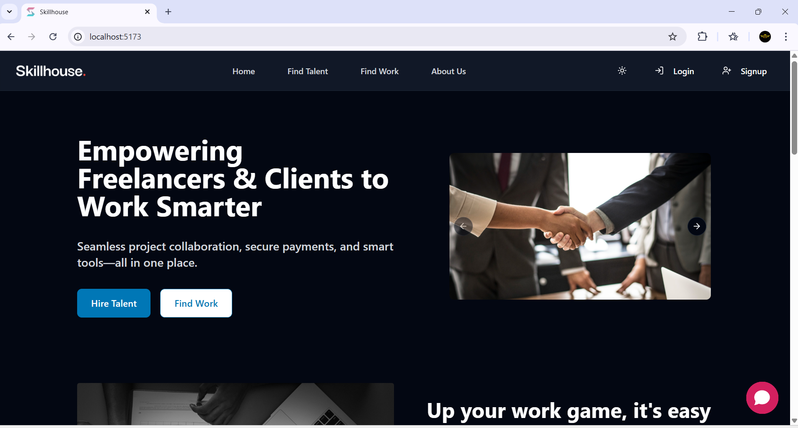
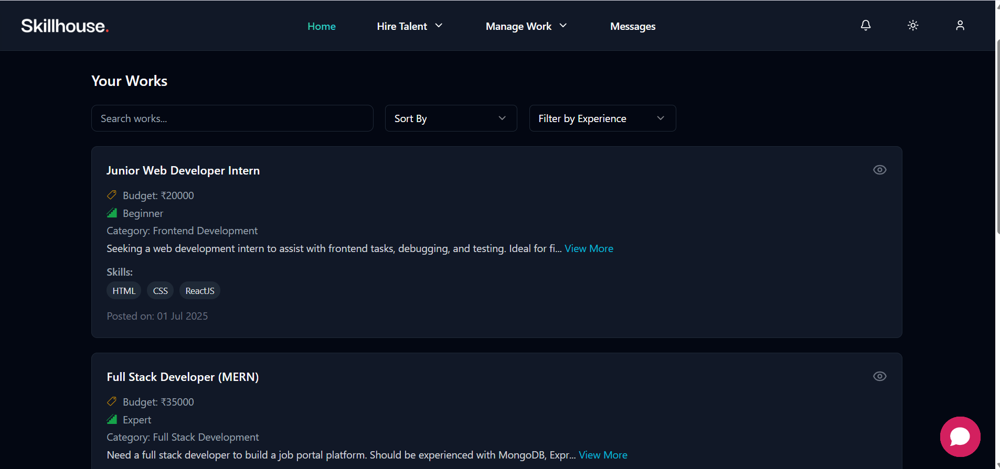
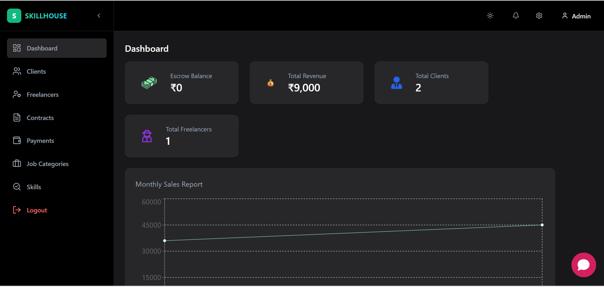
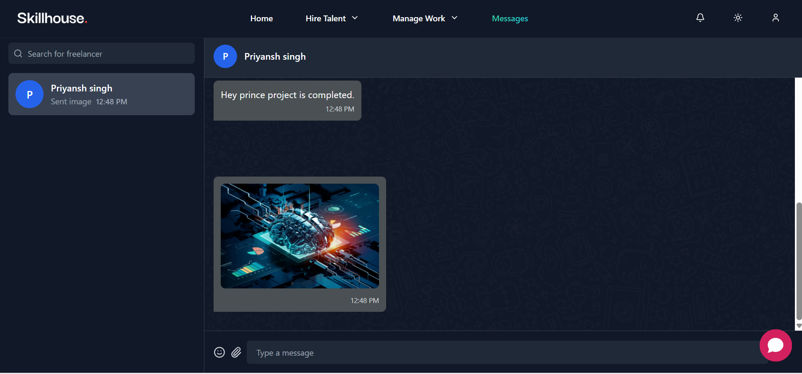

# Skillhouse 🧑‍💻💼



**Skillhouse** is a modern freelance marketplace and project management platform built with the **MERN stack**. It connects **Freelancers**, **Clients**, and **Admins** for seamless project collaboration, secure payments, and efficient communication.

---

## 🚀 Features

- 🔐 Role-Based Authentication using JWT (Freelancer, Client, Admin)  
- 💰 Escrow Wallet System with Refund & Release Functionality  
- 💳 Secure Stripe Payment Integration (with escrow, refund, and release)  
- 📦 Project & Contract Lifecycle Management  
- 💬 Real-time Chat between Clients & Freelancers  
- 🤖 Smart Bot Assistant for Handling Common Queries & Tasks  
- 📄 Proposal & Offer Workflow  
- 📊 Admin Dashboard with Revenue, Escrow, and User Tracking  

---

## 🖼️ Screenshots

**Work Page:**  


**Admin Dashboard:**  


**Chat System:**  


---

## 💳 Payment & Escrow Flow

- When a client creates a contract, they pay for the job upfront. The money is safely held in an escrow account on Skillhouse.
- After the freelancer finishes the work, the client reviews it and approves the payment if satisfied.
- Once approved by the client, the admin checks everything and then releases the payment to the freelancer.
- This process keeps things fair and secure for both clients and freelancers!

---

## 🛠 Tech Stack

- **Frontend**: React + Vite + TypeScript + TailwindCSS  
- **Backend**: Node.js + Express + TypeScript + MongoDB  
- **Payments**: Stripe  
- **State Management**: Redux Toolkit  
- **Styling**: TailwindCSS + Shadcn  
- **Authentication**: JSON Web Tokens (JWT)  
- **Architecture**: Repository Pattern  
- **Others**: Socket.io, Nodemailer, Redis (for OTP and password reset)  

---

## ⚙️ Getting Started

### 1. Clone the repository and run both servers

```bash
git clone https://github.com/omchaudhary007/SkillHouse.git
